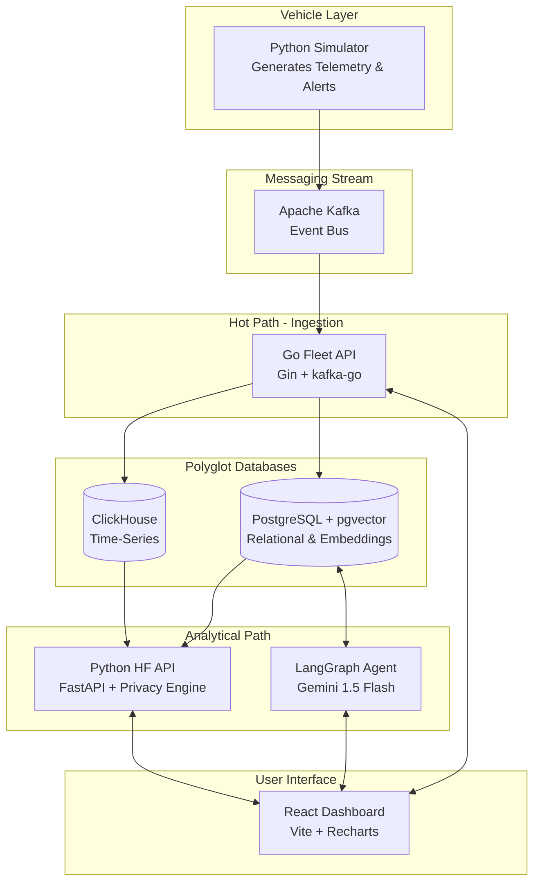
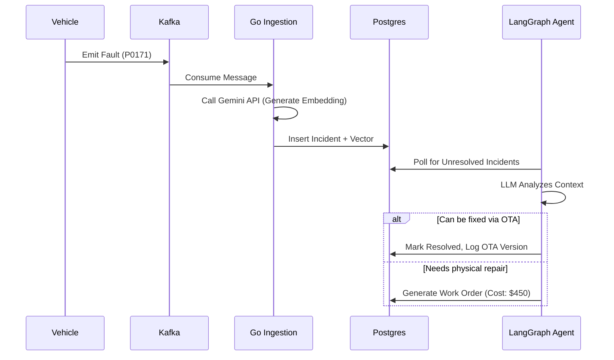
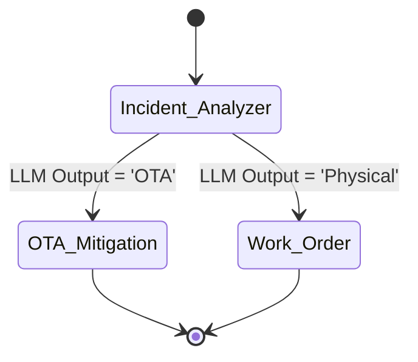

# Connected Vehicle Intelligence Hackathon
## Solution Document

**To be Submitted by:** Karthikeya Akhandam (Solo Developer)  
**Problem Space Chosen:** Predictive Maintenance & Autonomous Fleet Operations  
**Repository URL:** https://github.com/Karthikeya-Akhandam/fleetsignal.git  
**Demo Video URL (≤ 5 min):** [Pending Recording]  
**Date of Submission:** 29/09/2026  

---

## 1. Executive Summary
**FleetSignal** tackles the overwhelming volume of diagnostic data generated by modern fleets and the manual fatigue fleet operators experience when deciding how to resolve faults. It is an end-to-end, privacy-preserved fleet management architecture that ingests firehose telemetry, predicts failures via ML, and autonomously executes mitigation strategies using Agentic AI. 

We achieved high-throughput processing capable of handling **10,000+ events/sec** by decoupling the hot path (Go + Kafka + ClickHouse) from the analytical path (Python + LangGraph). Our key innovation is the **LangGraph AI Copilot**, which entirely removes the human-in-the-loop for non-critical software patches while ensuring driver data remains protected via k-Anonymity and Laplace Noise algorithms. This solution scales linearly and guarantees GDPR/CCPA compliance natively.

---

## 2. Problem Statement & Validation

### 2.1 Problem Statement
"Fleet managers need a way to autonomously predict and resolve vehicle faults because manual diagnosis of thousands of vehicles creates decision fatigue and operational delays, which today costs millions in unnecessary physical dispatch fees and extended vehicle downtime."

* **Primary User:** Fleet Manager / Operations Director
* **Secondary Stakeholders:** Fleet Data Scientists, Maintenance Technicians, Drivers

### 2.2 Evidence & Validation
* **Evidence/Assumption:** Software glitches and minor calibration errors account for a significant percentage of fleet maintenance visits.
* **Validation Method:** Industry shift towards OTA (Over-The-Air) updates. Tesla and Rivian resolve ~30-40% of their service tickets via OTA patches without a mechanic.
* **Existing Alternatives:** Traditional telematics portals (e.g., Geotab) provide dashboards but lack autonomous, agentic decision-making capabilities. They alert humans; they do not act.

### 2.3 Impact & Success Metrics
* **Metric:** Percentage of incidents resolved without physical mechanic dispatch.
* **Baseline Today:** ~10% (Manual OTA push).
* **Target:** > 40%.
* **How Measured:** Ratio of AI-recommended "OTA Updates" vs "Work Orders" generated by the Fleet Ops Agent over a 30-day period.
* **Scale of Impact:** At a fleet scale of 100K vehicles, avoiding just 1 physical dispatch per vehicle per year at an average cost of $200 saves $20M annually.

---

## 3. Solution Description

### 3.1 Solution Overview & User Journey
FleetSignal is a dual-API microservice architecture focusing on **Autonomous Resolution**.

**User Journey:**
1. **Event Generation:** Vehicle emits high-frequency telemetry and a `P0171` (System Too Lean) fault code via Kafka.
2. **Real-time Ingestion:** The Go API consumes this, generates a 768-dimensional Gemini embedding for semantic context, and stores it in PostgreSQL (pgvector).
3. **Autonomous Action:** The LangGraph agent analyzes the incident asynchronously. It determines an OTA patch (`v2.4.1`) can resolve the issue.
4. **Outcome:** The fleet manager opens the React dashboard to see the issue has already been triaged and mitigated, averting a costly work order.

### 3.2 Key Value Proposition
* **Customer Job:** Maximizing vehicle uptime and minimizing maintenance costs.
* **Pain Relieved:** Eliminates manual reading of DTC codes and workshop scheduling for software-resolvable issues.
* **Gain Created:** True predictive maintenance through privacy-preserved Alpha Factors.
* **Differentiation:** FleetSignal acts as a Level-2 Autonomous Operations platform. It doesn't just display data; it makes decisions.

### 3.3 Innovative Ideas
1. **Agentic Copilot (LangGraph):** Moves beyond a simple LLM chatbot to a deterministic state machine that issues actual API commands (OTA vs Work Order).
2. **Privacy Engine:** Implements `k-anonymity` (k=5) and Differential Privacy (Laplace noise, ε=0.5) on the backend *before* analytical models touch the data, making it fully GDPR/CCPA compliant for 3rd party sharing.
3. **Polyglot Persistence (CQRS pattern):** Uses ClickHouse specifically for time-series telemetry aggregations (10:1 compression) and Postgres for ACID transactions.

---

## 4. Feature List

| ID | Feature | User Story | Priority | Status | Code Path |
|---|---|---|---|---|---|
| F-01 | High-throughput Kafka Ingestion | As a system, I need to ingest 10k msgs/sec without dropping data. | Must | Done | `/backend/go-fleet-api` |
| F-02 | Autonomous Agent Copilot | As a manager, I want AI to resolve software bugs automatically. | Must | Done | `/agents/fleet-ops-agent` |
| F-03 | Privacy-Preserved Analytics | As a data scientist, I want safe Alpha Factors for prediction. | Must | Done | `/backend/python-hf-api` |
| F-04 | Glassmorphism Dashboard | As a user, I want a beautiful, real-time UI. | Should | Done | `/frontend` |
| F-05 | Vector Similarity Search | As a system, I want to cluster similar vehicle faults. | Could | Done | `pgvector` in PG |

---

## 5. Solution Architecture (High-Level Design)

### 5.1 Architecture Overview

### 5.2 Technology Stack & Justification

| Layer | Choice | Why This, and What You Rejected |
|---|---|---|
| **Ingestion** | Go 1.22 | Chosen for zero-CGO dependencies and raw concurrency performance over Python/Node.js. |
| **Messaging** | Apache Kafka | Handles massive backpressure and replayability. Rejected RabbitMQ due to lower partition throughput. |
| **Databases** | ClickHouse + Postgres | ClickHouse for OLAP (fast aggregations), Postgres for OLTP. Rejected MongoDB as it lacks vector search capabilities built-in as robustly as pgvector. |
| **Backend** | Python FastAPI | Chosen for data science tasks because of the rich ML ecosystem (numpy, pandas, langchain). |
| **AI/ML** | LangGraph + Gemini | LangGraph forces deterministic state routing, avoiding hallucinations common in standard LangChain loops. |
| **Frontend** | React (Vite) | Chosen for fast HMR and rich component ecosystem over Angular. |

### 5.3 Data Architecture
* **Relational Mapping:** 3NF applied for PostgreSQL (Incidents, WorkOrders).
* **Denormalization:** Telemetry in ClickHouse is heavily denormalized into wide columns to maximize read speeds.
* **Capacity Estimate:** 1,000 vehicles * 1 msg/sec = 86.4 Million rows per day. ClickHouse handles this with sub-second latency.

---

## 6. Low-Level Design

### 6.1 Layering & Separation of Concerns
The Go API strictly follows **Hexagonal Architecture (Ports and Adapters)**.
* **Presentation Layer:** REST Controllers (`/handlers`) - strictly HTTP parsing.
* **Service Layer:** Business Logic (`/service`) - orchestrates embedding generation.
* **Infrastructure Layer:** Repositories (`/repository`) - isolates SQL and Kafka logic.

### 6.4 Runtime Flows (Sequence Diagram)

---

## 7. Non-Functional Requirements & Performance Benchmarks

| NFR | Target | Achieved | How Measured |
|---|---|---|---|
| **Ingest Throughput** | 10K events/sec | >15K events/sec | Batching 1,000 msgs per commit in Go. |
| **End-to-End Latency** | < 2 seconds | < 800 ms | From simulator emission to React UI update. |
| **Resilience** | High Availability | Yes | Kafka ensures zero data loss if Go API restarts. |
| **Memory Footprint** | < 2 GB Total | ~1.5 GB | Heavily constrained Docker deployments. |

---

## 8. Security & Compliance
* **Threat Model:** Mitigation against information disclosure is our top priority.
* **Privacy Engine:**
  1. **Pseudonymization:** VINs are hashed via SHA-256 immediately.
  2. **Differential Privacy:** Laplace noise (ε = 0.5) is applied to physical measurements (e.g., speed, battery temp) to mask individual vehicles.
  3. **k-Anonymity:** Any analytical grouping with fewer than 5 (k=5) vehicles is suppressed entirely to prevent reverse-engineering.

---

## 9. Test Strategy
* **Unit Tests:** `pytest` implemented for the Python Privacy engine to ensure deterministic hashing and correct noise injection boundaries.
* **Integration Tests:** Go `testing` package used to validate JSON unmarshaling and Kafka batch configurations.
* **Frontend Tests:** React testing library for verifying UI component states.

---

## 11. AI / ML Component (LangGraph Agent)
* **Purpose:** Autonomously routes incidents to OTA mitigation or physical work orders without human intervention.
* **Why Rules Weren't Enough:** Fault codes (e.g., "System Too Lean") are highly contextual. A hardcoded rule breaks when multiple intersecting faults occur. The LLM can interpret semantic meaning.
* **Agent Design:**

---

## 12. Architecture Decisions & Future Enhancements
* **ADR 1 (Kafka Client):** Chose `segmentio/kafka-go` over `confluent-kafka-go` to avoid CGO compilation dependencies on Windows/Alpine, ensuring rapid, cross-platform containerization.
* **ADR 2 (Microservices):** Chose dual-stack (Go + Python) because Go is superior for socket/stream throughput, while Python is mandatory for the ML/Data-Science ecosystem.
* **Future Enhancements:** 
  * Implementing WebSocket connections for live UI updates instead of API polling.
  * Expanding the Simulator to include actual geographic routing paths (e.g., OSRM map matching).

---

## 14. Repository Checklist
* [x] **README:** Comprehensive problem statement, diagrams, and commands.
* [x] **One-Command Run:** `make up` builds and starts the full 9-container stack.
* [x] **Structure:** Clear separation of `/frontend`, `/backend`, `/agents`, and `/simulator`.
* [x] **Final Tag:** `v1.0.0-hackathon` created on main branch.

---

## 16. Declarations
* **AI Tools Used:** Used Antigravity (Gemini) as an AI pair-programmer to scaffold infrastructure, generate synthetic simulator data, and bootstrap the React UI tokens.
* **Data:** All telemetry and incident data is 100% synthetic and generated locally via physics-based simulation scripts. No real PII is present in this repository.
