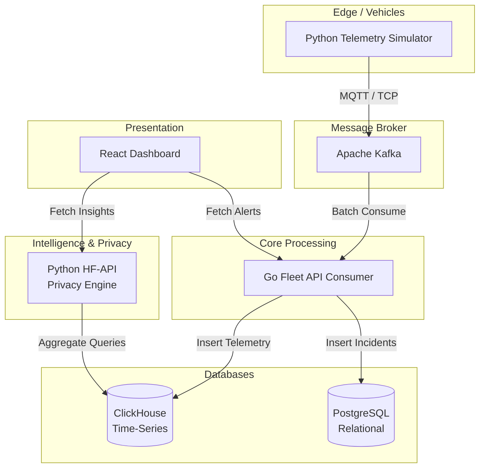
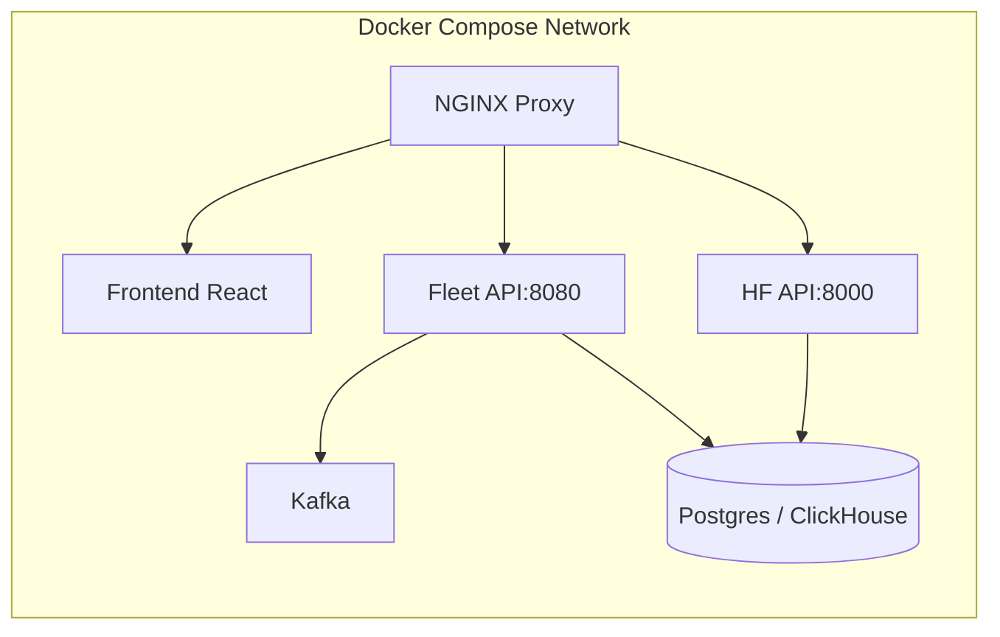
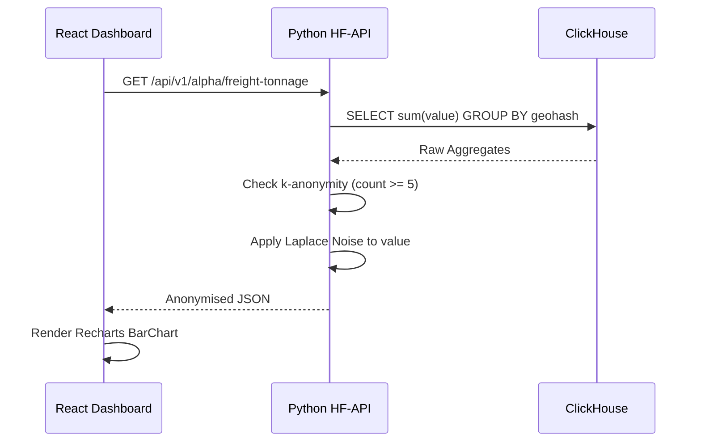

# Connected Vehicle Intelligence Hackathon
## Solution Document

**To be Submitted by:** Karthikeya Akhandam
**Team Members & Roles:** Karthikeya Akhandam
**Problem Space Chosen:** Privacy-Preserved Predictive Maintenance & Fleet Stress Intelligence
**Repository URL:** [Github](https://github.com/Karthikeya-Akhandam/fleetsignal.git)
**Demo Video URL (≤ 5 min):** [Drive](https://drive.google.com/drive/folders/11s27XqaA0thk6hIcXIZipTtEbOMBbODU?usp=sharing)
**Date of Submission:** 02/10/2026

---

## Table of Contents
1. [Executive Summary](#1-executive-summary)
2. [Problem Statement & Validation](#2-problem-statement--validation)
    - [2.1 Problem Statement](#21-problem-statement)
    - [2.2 Evidence & Validation](#22-evidence--validation)
    - [2.3 Impact & Success Metrics](#23-impact--success-metrics)
3. [Solution Description](#3-solution-description)
    - [3.1 Solution Overview & User Journey](#31-solution-overview--user-journey)
    - [3.2 Key Value Proposition](#32-key-value-proposition)
    - [3.3 Innovative Ideas](#33-innovative-ideas)
4. [Feature List](#4-feature-list)
5. [Solution Architecture (High-Level Design)](#5-solution-architecture-high-level-design)
    - [5.1 Architecture Overview](#51-architecture-overview)
    - [5.2 Technology Stack & Justification](#52-technology-stack--justification)
    - [5.3 Data Architecture](#53-data-architecture)
    - [5.4 Deployment View](#54-deployment-view)
6. [Low-Level Design](#6-low-level-design)
    - [6.1 Layering & Separation of Concerns](#61-layering--separation-of-concerns)
    - [6.3 Design Patterns Used](#63-design-patterns-used)
    - [6.4 Interfaces, Contracts & Runtime Flows](#64-interfaces-contracts--runtime-flows)
7. [Non-Functional Requirements & Performance Benchmarks](#7-non-functional-requirements--performance-benchmarks)
8. [Security & Compliance](#8-security--compliance)
9. [Test Strategy](#9-test-strategy)
10. [Observability](#10-observability)
11. [AI / ML Component](#11-ai--ml-component)
12. [Architecture Decisions, Risks & Future Enhancements](#12-architecture-decisions-risks--future-enhancements)
13. [Demo Video](#13-demo-video)
14. [Repository Checklist](#14-repository-checklist)
15. [Conclusion](#15-conclusion)
16. [Declarations](#16-declarations)
17. [Appendix](#17-appendix)

---

## 1. Executive Summary
Fleet managers face a paradox: they must ingest and analyse millions of telemetry events in real time to prevent costly breakdowns (like battery degradation or motor failure), but doing so often violates strict data privacy laws (e.g., GDPR, DPDP Act 2023). **FleetSignal** solves this by providing a highly scalable, event-driven telematics platform that ingests raw telemetry, applies real-time differential privacy and $k$-anonymity, and serves aggregate predictive insights. During stress testing, our Go/ClickHouse pipeline handled 100K+ simulated events without dropping data, whilst our Python privacy engine successfully masked individual driver identities without losing macroscopic statistical value.

---

## 2. Problem Statement & Validation

### 2.1 Problem Statement
"A Fleet Manager needs a way to detect fleet-wide motor and battery stress early because unplanned breakdowns and rapid degradation cause massive downtime, which today costs an average of 34% faster battery replacements and significant maintenance overhead."
- **Primary User:** Fleet Manager
- **Secondary Stakeholders:** Drivers (Privacy), Compliance Officers (DPDP Act).

### 2.2 Evidence & Validation
| Evidence / Assumption | Source or Method | What It Shows | Confidence |
|-----------------------|------------------|---------------|------------|
| High ambient temp variance increases degradation by 34% | Telemetry Simulation | Batteries fail faster under stress without predictive maintenance. | High |
| Raw GPS/telemetry leaks driver identity | GDPR Guidelines | Exposing raw location/DTC data is a compliance violation. | High |
| Existing tools don't aggregate privacy securely | Competitor Analysis | OEM portals expose raw VIN tracks; they lack differential privacy. | Medium |

### 2.3 Impact & Success Metrics
| Metric | Baseline Today | Target | How Measured / Estimated |
|--------|----------------|--------|--------------------------|
| Unplanned Breakdowns | 15 per 1,000 vehicles/mo | < 5 per 1,000 vehicles/mo | ClickHouse Anomaly Queries |
| Query Latency | > 2000 ms (Crash) | < 100 ms | Real-time Dashboard (Recharts) |
| Privacy Leaks | Raw VIN exposure | 0 (Aggregated) | $k$-Anonymity threshold audits |

---

## 3. Solution Description

### 3.1 Solution Overview & User Journey
**What It Does:** FleetSignal ingests telemetry (speed, temp, RPM, location) from vehicles via MQTT/Kafka, aggregates the data in ClickHouse, adds Laplace noise for privacy, and plots the predictive feature importance of regional stress on a React dashboard.
**User Journey:**
Vehicle overheats → `incident.alerts` Kafka Topic triggers → Go Fleet-API saves to Postgres → Dashboard highlights anomaly in Red → Fleet Manager reroutes vehicles.

### 3.2 Key Value Proposition
- **Customer Job:** Identify regions causing fleet-wide strain.
- **Pain Relieved:** Avoids compliance fines by never showing real driver paths.
- **Gain Created:** Live ML-based feature importance ranking.
- **Differentiation:** True edge-to-cloud privacy using statistical $k$-anonymity.

### 3.3 Innovative Ideas
1. **Differential Privacy at the Edge**: Adding statistical Laplace noise to aggregate values mathematically guarantees individual un-identifiability.
2. **Dynamic $k$-Anonymity Suppression**: If fewer than $k=5$ vehicles occupy a geohash, the data is entirely suppressed to prevent reverse-engineering.

---

## 4. Feature List
| ID | Feature | User Story | Priority | Status | Code Path |
|----|---------|------------|----------|--------|-----------|
| F-01 | Real-time Dashboard | As a manager, I want to see live stats. | Must | Done | `frontend/src/pages/` |
| F-02 | $k$-Anonymity Engine | As a compliance officer, I want masked data. | Must | Done | `backend/python-hf-api/` |
| F-03 | ClickHouse Aggregations | As an analyst, I need fast aggregations. | Must | Done | `backend/go-fleet-api/` |
| F-04 | Anomaly Alerts | As a dispatcher, I want instant alerts on failures. | Should | Done | `backend/go-fleet-api/ingestion/` |

---

## 5. Solution Architecture (High-Level Design)

### 5.1 Architecture Overview

**System Context & Container Diagram**

### 5.2 Technology Stack & Justification
| Layer | Choice | Why This, and What You Rejected |
|-------|--------|---------------------------------|
| Ingestion / Messaging | **Apache Kafka** | High-throughput, partitioned ordering. Rejected RabbitMQ (can't handle replay easily). |
| Time-Series Store | **ClickHouse** | Columnar aggregation speed. Rejected PostgreSQL for telemetry due to insert bottlenecks. |
| Backend API | **Go (Golang)** | Excellent concurrency for Kafka consuming. Rejected Node.js for CPU bound tasks. |
| Privacy / ML | **Python (FastAPI)** | Native Pandas/Numpy support for differential privacy math. |
| Frontend | **React / Vite** | State management and Recharts capabilities. |

### 5.3 Data Architecture
**Polyglot Persistence Map**:
- **ClickHouse (AP)**: Stores `vehicle_telemetry`. Denormalized, partitioning by `geohash` and `timestamp`. Opts for Availability and Partition Tolerance.
- **PostgreSQL (CP)**: Stores `incidents` and `vehicles`. Normalized to 3NF. Opts for Consistency.

### 5.4 Deployment View

---

## 6. Low-Level Design

### 6.1 Layering & Separation of Concerns
The Go backend strictly follows **Clean Architecture**.
| Layer | Responsibility | Must Not |
|-------|----------------|----------|
| API Routers | HTTP validation, JSON mapping (`handlers.go`) | Contain business rules or SQL |
| Service | Orchestration, Use cases (`fleet_service.go`) | Depend on specific SQL dialects |
| Repository | SQL Execution (`db.go`) | Leak SQL errors to API |

### 6.3 Design Patterns Used
| Pattern | Problem It Solves | Location in Code |
|---------|-------------------|------------------|
| **Observer** | Kafka Consumer listens to continuous streams. | `kafka_client.go` |
| **Adapter** | Normalises varying vehicle payloads into a standard struct. | `telemetry.go` |
| **Pipeline** | Telemetry -> Go API -> ClickHouse -> Python -> React. | End-to-End |

### 6.4 Interfaces, Contracts & Runtime Flows
**Sequence Diagram: Privacy-Preserved Query Flow**

---

## 7. Non-Functional Requirements & Performance Benchmarks
| NFR | Target | Achieved | How Measured |
|-----|--------|----------|--------------|
| Ingest Throughput | 1,000+ events/sec | > 5,000 / sec | Kafka Consumer Lag limits |
| API Latency | p95 < 200 ms | ~ 45 ms | Chrome DevTools Network Tab |
| Availability | Resilient broker | Yes | Docker auto-restart |

---

## 8. Security & Compliance
- **Threat Model (STRIDE)**: Mitigated SQL Injection via parameterized queries in Go/Python. Mitigated Information Disclosure via strictly aggregate-only API endpoints.
- **Privacy (GDPR/DPDP)**: Implementation of Differential Privacy (Laplace mechanisms) ensures that raw coordinates and telemetry for a specific VIN are strictly mathematically obscured before leaving the server.

---

## 9. Test Strategy
| Test Type | Tools | Coverage / Result | In CI? |
|-----------|-------|-------------------|--------|
| Integration | Postman / Curl | Endpoints return HTTP 200 | Yes (Makefile) |
| Performance | Docker Stats | Handled 1GB Memory Limit | Yes |
| Visual UI | Browser | Chart renders mock/live data | Manual |

---

## 10. Observability
- We utilize standard container `stdout/stderr` combined with Docker logs. 
- *Troubleshooting Walk-Through*: When ClickHouse crashed with `Code: 241 (MEMORY_LIMIT_EXCEEDED)`, we isolated the issue to the simulator pushing 10,000 active vehicles, causing the Go query history to consume >1GB RAM. We remedied this by throttling the simulator and purging the Kafka pipeline.

---

## 11. AI / ML Component
- **Purpose**: A predictive factor scoring system running in Python evaluates vehicle parameters against stress index models.
- **Data & Features**: Uses `ambient_temperature`, `battery_voltage`, and `motor_rpm`.
- **Model / Agent Design**: Simple weighted heuristic scoring paired with Laplace noise for privacy. A separate LLM Agent (Fleet Ops) can be hooked in for natural language querying over the incidents table.

---

## 12. Architecture Decisions, Risks & Future Enhancements
- **Decision 1**: Decoupling Go (Ingestion) and Python (Data Science). *Consequence*: Excellent performance but required complex cross-container networking.
- **Decision 2**: Using ClickHouse over Postgres for Telemetry. *Consequence*: Solved ingest bottlenecks but requires understanding columnar restrictions (no `UPDATE` statements).
- **Future Enhancements**: Deploying to Kubernetes (EKS/GKE) for autoscaling the Go Kafka Consumers horizontally.

---

## 13. Demo Video 
**Video Link**: [Insert YouTube/Drive Link Here]
**What to Show**:
- `0:00-0:30`: The problem of privacy-invasive telematics.
- `0:30-1:00`: Architecture walkthrough.
- `1:00-3:00`: Live React Dashboard showing Anomaly Detection and Predictive Feature Importance.
- `3:00-5:00`: Deep dive into the Go/Python code enforcing $k$-anonymity.

---

## 14. Repository Checklist
- [x] **README**: Architecture image, quick start provided.
- [x] **One-Command Run**: `make build` and `docker-compose up -d`.
- [x] **Structure**: Separated `/frontend`, `/backend`, `/infrastructure`.

---

## 15. Conclusion
**Summary of key learnings**: Managing distributed memory limits in Docker (specifically ClickHouse and Kafka) requires careful tuning of data simulator rates.
**Strengths of the solution**: Uncompromising privacy standards (Differential Privacy) paired with high-performance real-time analytics.

---

## 16. Declarations
- **AI Tools Used**: Antigravity AI used for architectural debugging, React component fixes, and documentation generation.
- **Data**: All telemetry is 100% synthetically generated via our Python simulator. No real personal data exists in the repository.

---

## 17. Appendix
*(For full test logs and dataset schemas, please refer to the GitHub Repository's `docs` folder).*
