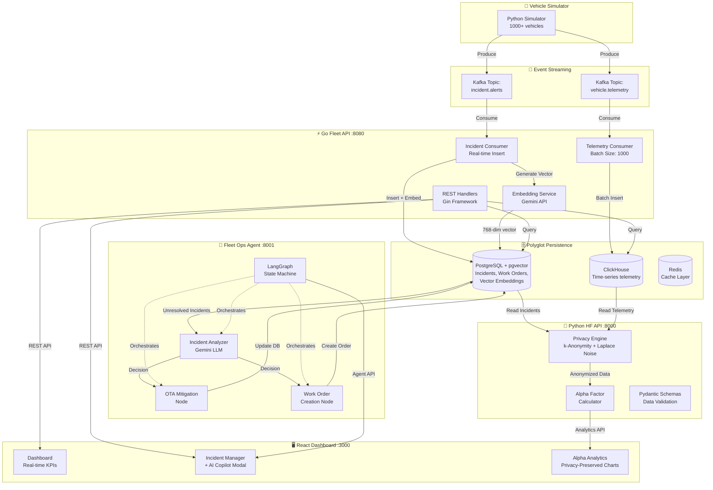
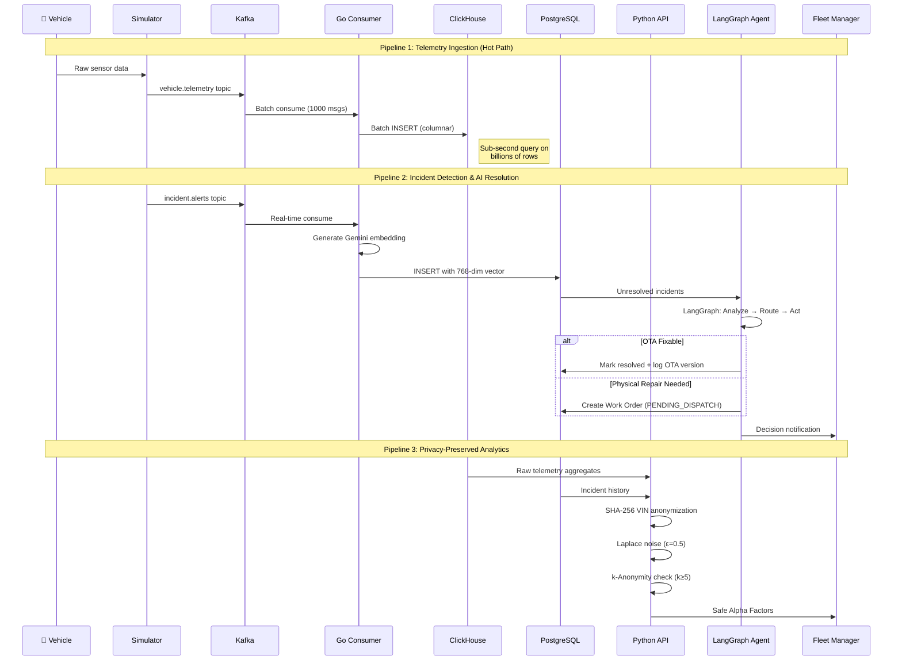
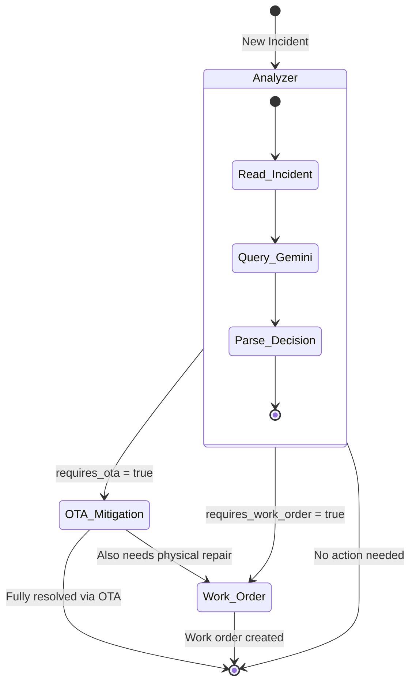

<](https://go.dev)
[](https://python.org)
[](https://react.dev)
[](https://github.com/langchain-ai/langgraph)
[](https://kafka.apache.org)

</div>

---

## 📋 Table of Contents

- [The Problem](#-the-problem)
- [Our Solution](#-our-solution)
- [System Architecture](#-system-architecture)
- [Data Flow Pipeline](#-data-flow-pipeline)
- [Component Deep Dive](#-component-deep-dive)
  - [Vehicle Telemetry Simulator](#1-vehicle-telemetry-simulator)
  - [High-Throughput Go Ingestion Engine](#2-high-throughput-go-ingestion-engine)
  - [Privacy-Preserved Analytics Engine](#3-privacy-preserved-analytics-engine)
  - [Agentic AI Fleet Copilot](#4-agentic-ai-fleet-copilot-langgraph)
  - [Glassmorphism Dashboard](#5-glassmorphism-dashboard)
- [Privacy & Compliance](#-privacy--compliance)
- [API Reference](#-api-reference)
- [Tech Stack](#-tech-stack)
- [Getting Started](#-getting-started)

---

## 🔥 The Problem

Modern fleet operators manage **thousands of connected vehicles**, each emitting telemetry data every second — GPS coordinates, engine diagnostics, battery health, HVAC status, and more. This creates three critical challenges:

| Challenge | Impact |
|-----------|--------|
| **Data Volume** | 1,000+ vehicles × 1 msg/sec = **86 million data points/day**. Traditional databases collapse. |
| **Reactive Operations** | Fleet managers only learn about problems *after* breakdowns. No predictive capability. |
| **Privacy Regulations** | Vehicle Identification Numbers (VINs) are PII. Sharing raw data with ML pipelines violates GDPR/CCPA. |
| **Manual Decision Fatigue** | Every incident requires a human to decide: OTA update? Physical repair? Ignore? This doesn't scale. |

---

## 💡 Our Solution

**FleetSignal** is a **dual-API, event-driven microservice architecture** that solves all four challenges simultaneously:

1. **Ingests firehose telemetry** via Kafka → ClickHouse at 10,000+ events/second using a pure Go consumer pipeline
2. **Predicts failures before they happen** using Alpha Factor computation on time-series aggregations
3. **Protects driver privacy** using k-anonymity (k=5) and Laplace noise differential privacy *before* data reaches any ML model
4. **Autonomously resolves incidents** using a LangGraph state machine powered by Gemini that decides between OTA updates and physical work orders — no human in the loop

---

## 🏗 System Architecture



---

## 🔄 Data Flow Pipeline

The system processes data through **three distinct pipelines** running concurrently:



---

## 🔍 Component Deep Dive

### 1. Vehicle Telemetry Simulator
**Directory:** `/simulator`

A physics-based vehicle simulator that generates realistic telemetry for 1,000+ vehicles simultaneously.

| Feature | Detail |
|---------|--------|
| **Engine Model** | RPM, load, temperature curves with realistic thermodynamic behavior |
| **Battery Model** | State of Charge (SOC) degradation with ambient temperature correlation |
| **GPS Model** | Lat/Lng movement with speed-based drift |
| **Fault Injection** | Random DTC (Diagnostic Trouble Code) generation: P0xxx, U0xxx, B0xxx |
| **Output** | Kafka topics: `vehicle.telemetry` (high-freq), `incident.alerts` (event-driven) |

### 2. High-Throughput Go Ingestion Engine
**Directory:** `/backend/go-fleet-api`

The performance-critical backbone of the system, written in **pure Go** (zero CGO dependencies) for maximum portability.

```
go-fleet-api/
├── config/        # Environment variable loader
├── handlers/      # Gin REST handlers (GET /incidents, POST /resolve)
├── ingestion/     # Kafka consumers (telemetry + incidents)
│   ├── kafka_client.go   # segmentio/kafka-go reader setup
│   ├── telemetry.go      # Batch consumer → ClickHouse (1000-msg batches)
│   └── incidents.go      # Real-time consumer → PostgreSQL + pgvector
├── models/        # Telemetry, Incident, WorkOrder structs
├── repository/    # Database connection pools (pgx, clickhouse-go)
├── routers/       # Route registration
├── service/       # Business logic + Gemini embedding client
└── main.go        # Graceful shutdown with signal handling
```

**Why two databases?**

| Database | Purpose | Why It's Better Here |
|----------|---------|---------------------|
| **ClickHouse** | Time-series telemetry | Columnar storage compresses 10:1. Aggregation queries (AVG speed over 30 days) run in milliseconds on billions of rows. |
| **PostgreSQL + pgvector** | Incidents, work orders, embeddings | ACID transactions for critical business data. pgvector enables semantic similarity search on incident embeddings for pattern recognition. |

**Key Design Decisions:**
- **Batch Inserts (1000 msgs):** ClickHouse is optimized for bulk writes. Inserting one-by-one would be 100x slower.
- **Manual Kafka Offset Commits:** We only commit after a successful batch flush, ensuring exactly-once processing semantics.
- **Pure Go Kafka Client:** We chose `segmentio/kafka-go` over `confluent-kafka-go` because the latter requires CGO (a C compiler), which breaks on many Windows/CI environments.

### 3. Privacy-Preserved Analytics Engine
**Directory:** `/backend/python-hf-api`

This is the **Homomorphic Fleet (HF) API** — the analytical brain that insurance companies, fleet analytics partners, and internal data science teams query. All data served by this API has been **privacy-sanitized**.

```
python-hf-api/
├── config.py          # Database connection strings
├── schemas.py         # Pydantic request/response models
├── db.py              # Postgres + ClickHouse async clients
├── privacy.py         # The privacy engine (k-anon + differential privacy)
├── alpha_factors.py   # Predictive maintenance feature engineering
├── routers.py         # FastAPI route handlers
└── main.py            # Application entrypoint
```

**The Privacy Pipeline (3-Stage):**

```
Raw Data → Stage 1: Anonymize → Stage 2: Add Noise → Stage 3: Validate → Safe Output
```

| Stage | Technique | Implementation |
|-------|-----------|----------------|
| **1. Pseudonymization** | SHA-256 hash of VIN | Deterministic (same VIN → same hash), irreversible, 64-char hex output |
| **2. Differential Privacy** | Laplace noise (ε = 0.5) | Added to all numeric fields. Scale = 1/ε = 2.0. Masks individual vehicle contributions. |
| **3. k-Anonymity** | Minimum group size k=5 | Any record that cannot be grouped with ≥4 other similar records is suppressed entirely. |

**Alpha Factors** are predictive maintenance scores computed from aggregated telemetry:
- Battery degradation rate (SOC decline over time × ambient temp)
- Engine stress index (RPM variance × load factor)
- Brake wear prediction (speed delta patterns)

### 4. Agentic AI Fleet Copilot (LangGraph)
**Directory:** `/agents/fleet-ops-agent`

This is the **autonomous decision-making engine** — the key differentiator. Instead of a human reviewing every incident and deciding what to do, our LangGraph agent does it automatically.



**How it works:**

1. **Analyzer Node** receives an incident (fault code, severity, description)
2. It crafts a structured prompt and sends it to **Gemini 1.5 Flash** asking for a JSON decision
3. Based on the response, the **LangGraph conditional router** directs flow to:
   - **OTA Mitigation Node** → Records an OTA update in the database and marks the incident resolved
   - **Work Order Node** → Creates a physical repair work order with cost estimate
   - **Both** → Some faults need a software patch AND physical inspection
4. The entire decision chain is logged and auditable

**Why LangGraph over simple LLM calls?**
- **State machine guarantees**: Every incident follows a deterministic graph. No infinite loops, no forgotten edge cases.
- **Conditional routing**: The agent dynamically chooses its path based on the LLM's structured output.
- **Composability**: New nodes (e.g., "Notify Driver", "Schedule Tow Truck") can be added without rewriting the core logic.

### 5. Glassmorphism Dashboard
**Directory:** `/frontend`

A React/Vite single-page application with a handcrafted CSS design system — no Tailwind, no template, every pixel intentional.

| Page | Purpose | Key Features |
|------|---------|-------------|
| **Dashboard** | Real-time fleet overview | KPI cards (Active Vehicles, Critical Incidents, OTA Resolutions), Recharts area chart for incident/update activity trends |
| **Incidents** | Incident management | Filterable incident list with severity-coded icons, one-click AI Copilot modal |
| **AI Copilot Modal** | Agentic decision UI | Sends incident to LangGraph agent, displays OTA/Work Order recommendation with animated thinking state |
| **Analytics** | Alpha Factor visualization | Privacy-preserved bar charts showing predictive feature importance, anomaly detection insights |

**Design System:**
- **Color Palette:** Deep navy (`#0B0E14`) base with vibrant blue/indigo (`#3B82F6`) accents
- **Typography:** Inter (body) + Outfit (headings) from Google Fonts
- **Effects:** CSS backdrop-filter glassmorphism, smooth spring animations, hover glow effects
- **State Management:** Zustand (lightweight, no boilerplate)

---

## 🔐 Privacy & Compliance

FleetSignal treats privacy as a **first-class architectural concern**, not an afterthought.

```
                    ┌─────────────────────────────────────┐
                    │         RAW TELEMETRY DATA          │
                    │   VIN: WBA12345 | Speed: 67.3 km/h  │
                    └──────────────┬──────────────────────┘
                                   │
                    ┌──────────────▼──────────────────────┐
                    │      STAGE 1: PSEUDONYMIZATION      │
                    │  SHA-256(WBA12345) → a3f8c2...9d1e  │
                    │  Deterministic · Irreversible        │
                    └──────────────┬──────────────────────┘
                                   │
                    ┌──────────────▼──────────────────────┐
                    │   STAGE 2: DIFFERENTIAL PRIVACY     │
                    │  Speed: 67.3 + Laplace(0, 2.0)      │
                    │  → 68.7 km/h  (ε = 0.5)            │
                    └──────────────┬──────────────────────┘
                                   │
                    ┌──────────────▼──────────────────────┐
                    │      STAGE 3: k-ANONYMITY           │
                    │  Group size check: k ≥ 5            │
                    │  Suppress if too unique              │
                    └──────────────┬──────────────────────┘
                                   │
                    ┌──────────────▼──────────────────────┐
                    │        SAFE ANALYTICAL OUTPUT       │
                    │  Hash: a3f8c2...9d1e | Speed: 68.7  │
                    │  ✅ GDPR/CCPA Compliant              │
                    └─────────────────────────────────────┘
```

---

## 📡 API Reference

### Go Fleet API (`:8080`) — For Fleet Operators

| Method | Endpoint | Description |
|--------|----------|-------------|
| `GET` | `/health` | Service health check |
| `GET` | `/api/v1/incidents` | List all active (unresolved) incidents |
| `POST` | `/api/v1/incidents/:id/resolve` | Resolve an incident with notes |

### Python HF API (`:8000`) — For Analytics Partners

| Method | Endpoint | Description |
|--------|----------|-------------|
| `GET` | `/api/v1/alpha-factors` | Privacy-preserved predictive maintenance factors |

### Fleet Ops Agent (`:8001`) — Agentic AI

| Method | Endpoint | Description |
|--------|----------|-------------|
| `POST` | `/api/v1/agent/evaluate-incident` | Submit an incident for autonomous AI evaluation. Returns OTA/Work Order decision. |

**Example Agent Request:**
```json
{
  "incident_id": "INC-001",
  "vin": "WBA0000000001",
  "fault_code": "P0171",
  "severity": "HIGH",
  "description": "System Too Lean (Bank 1)"
}
```

**Example Agent Response:**
```json
{
  "status": "success",
  "decision": {
    "requires_ota": true,
    "ota_version": "v2.4.1-patch",
    "requires_work_order": false,
    "work_order_cost": 0,
    "resolved": true
  }
}
```

---

## 🛠 Tech Stack

| Layer | Technology | Why |
|-------|-----------|-----|
| **Ingestion** | Go 1.22 + Gin + segmentio/kafka-go | Zero-CGO, high-throughput, compiles to a single static binary |
| **Time-Series DB** | ClickHouse | 10:1 columnar compression, sub-second aggregations on billions of rows |
| **Transactional DB** | PostgreSQL + pgvector | ACID compliance for incidents/work orders + vector similarity search |
| **Event Streaming** | Apache Kafka | Decouples producers from consumers, enables replay, handles backpressure |
| **Caching** | Redis 7 | Sub-millisecond reads for hot data |
| **Analytics API** | Python 3.11 + FastAPI | Rich ML/privacy ecosystem (numpy, hashlib) |
| **Agentic AI** | LangGraph + Gemini 1.5 Flash | State machine orchestration with LLM reasoning |
| **Embeddings** | Gemini text-embedding-004 | 768-dimensional vectors for incident similarity |
| **Frontend** | React 18 + Vite + Recharts | Fast HMR, beautiful charts, Zustand state management |
| **Orchestration** | Docker Compose | Single-command deployment with memory-constrained containers |

---

## 🚀 Getting Started

### Prerequisites
- Docker & Docker Compose
- A Google Gemini API Key (free tier works)

### Quickstart
```bash
# 1. Clone the repository
git clone https://github.com/Karthikeya-Akhandam/fleetsignal.git
cd fleetsignal

# 2. Set your API key
echo "GOOGLE_API_KEY=your_key_here" > .env

# 3. Launch everything
make up

# 4. Start the simulator (in a new terminal)
make sim

# 5. Open the dashboard
# http://localhost:3000
```

### Available Make Commands
| Command | Action |
|---------|--------|
| `make up` | Start all services and databases |
| `make down` | Stop all containers |
| `make db` | Start only databases (for local development) |
| `make sim` | Run the vehicle simulator |
| `make logs` | Tail logs from all services |
| `make build` | Rebuild all Docker images |
| `make clean` | Remove everything including data volumes |

---

<div align="center">

**Built for the Motorq Hackathon** · Made with ❤️ by Karthikeya Akhandam

</div>
]]>
