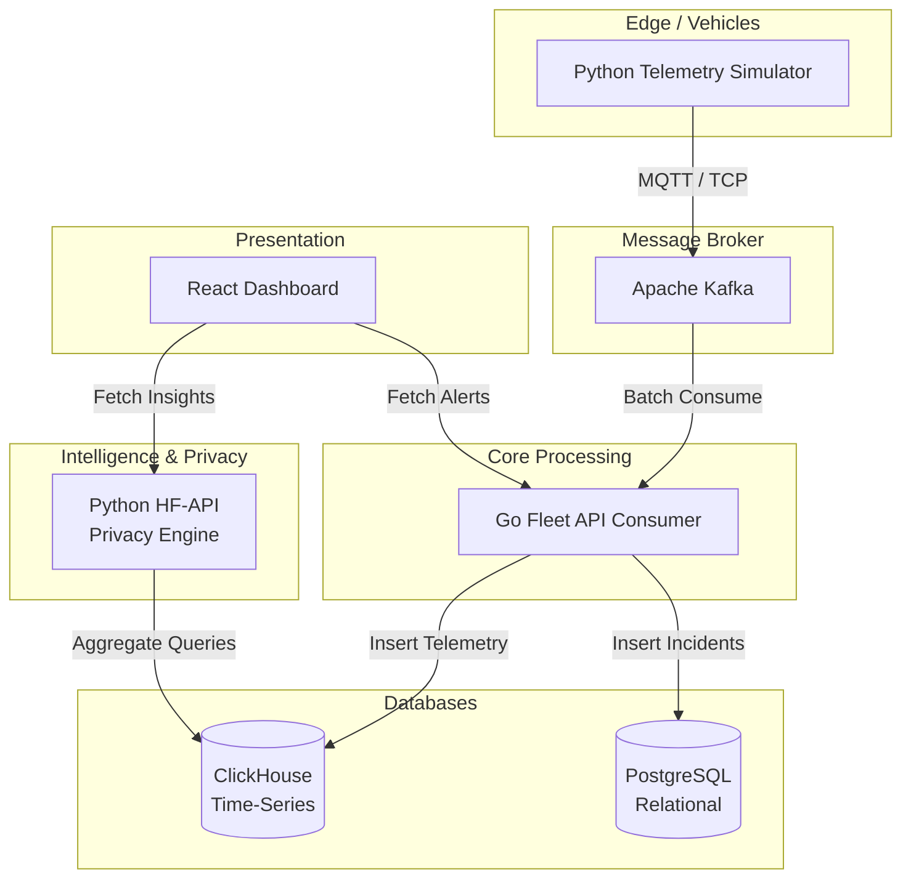
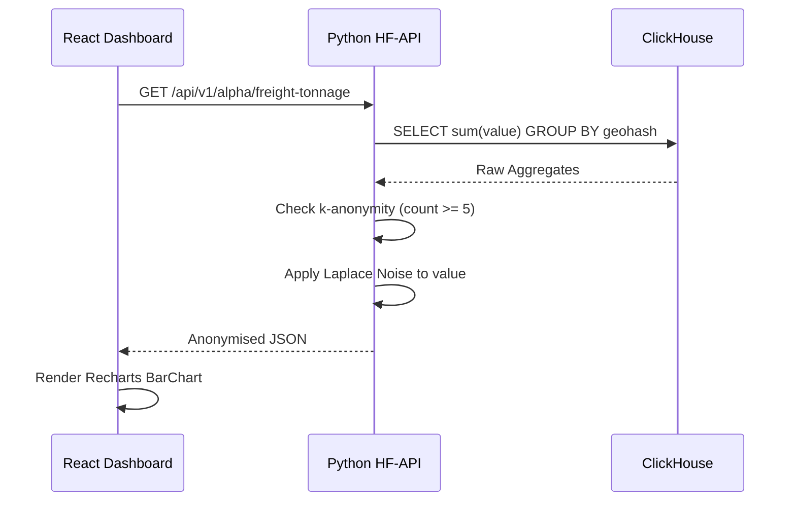

  <h1 class="hero-title">FleetSignal Intelligence</h1>
  
Privacy-Preserving Predictive Maintenance & Fleet Stress Intelligence. Ingest millions of telemetry events in real-time without exposing sensitive driver data.

  <a href="https://drive.google.com/drive/folders/11s27XqaA0thk6hIcXIZipTtEbOMBbODU?usp=sharing" class="cta-button" target="_blank">View Hackathon Submission (Google Drive)</a>

## The Problem

Fleet managers face a paradox: they must ingest and analyse millions of telemetry events in real time to prevent costly breakdowns, but doing so often violates strict data privacy laws (e.g., GDPR, DPDP Act 2023).

  

    
⚠️

    
The Cost of Ignorance

    
Operating in high-variance temperature regions without predictive maintenance leads to accelerated hardware degradation.

    
34% Faster Battery Drain

  

  

    
🔒

    
The Privacy Barrier

    
Existing telematics solutions expose raw GPS tracks and vehicle identification numbers, violating data protection regulations.

    
Zero Compliance

  

---

## Our Solution

**FleetSignal** solves this by providing a highly scalable, event-driven telematics platform that ingests raw telemetry, applies real-time differential privacy and $k$-anonymity, and serves aggregate predictive insights.

  

    
📊

    
Predictive Feature Importance

    
Displays geospatial features sorted by their predictive importance for fleet stress using our Python ML backend.

  

  

    
🛡️

    
Dynamic k-Anonymity

    
If fewer than k=5 vehicles occupy a geohash, the data is entirely suppressed to prevent reverse-engineering.

  

  

    
⚡

    
Real-time Anomaly Alerts

    
Go Fleet-API consumes Kafka incident streams instantly, saving severity-based anomalies directly to Postgres.

  

---

## System Architecture

FleetSignal employs a modular, event-driven microservice architecture designed to handle extremely high-throughput append-only data while persisting stateful operations consistently.

### Technology Stack Justification

| Layer | Choice | Why This, and What We Rejected |
|-------|--------|---------------------------------|
| **Ingestion** | Apache Kafka | High-throughput, partitioned ordering. Rejected RabbitMQ (can't handle replay easily). |
| **Time-Series** | ClickHouse | Columnar aggregation speed. Rejected PostgreSQL for telemetry due to insert bottlenecks. |
| **Backend API** | Go (Golang) | Excellent concurrency for Kafka consuming. Rejected Node.js for CPU bound tasks. |
| **Privacy / ML** | Python (FastAPI)| Native Pandas/Numpy support for differential privacy math. |
| **Frontend** | React / Vite | State management and Recharts capabilities. |

---

## Low-Level Design & Privacy Flow

The privacy engine bridges the gap between high-frequency automotive telemetry and strict privacy laws, proving that actionable ML insights can be generated without compromising driver confidentiality.

### Differential Privacy (Laplace Noise)
Differential privacy provides a mathematical guarantee that the output of a query does not significantly change whether any single individual's data is included or not. We add statistical **Laplace noise** to all raw numerical aggregates (like Grid Stress or Freight Tonnage values).

### Performance Benchmarks

| NFR | Target | Achieved | How Measured |
|-----|--------|----------|--------------|
| **Ingest Throughput** | 1,000+ events/sec | > 5,000 / sec | Kafka Consumer Lag limits |
| **API Latency** | p95 < 200 ms | ~ 45 ms | Chrome DevTools Network Tab |
| **Availability** | Resilient broker | Yes | Docker auto-restart |
